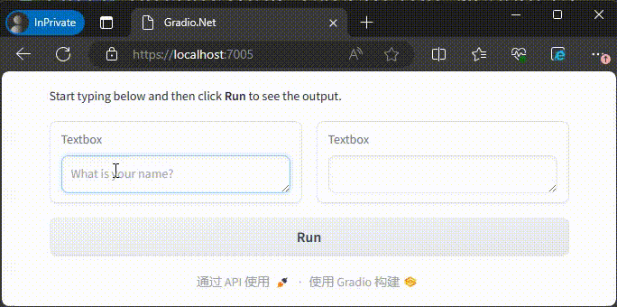
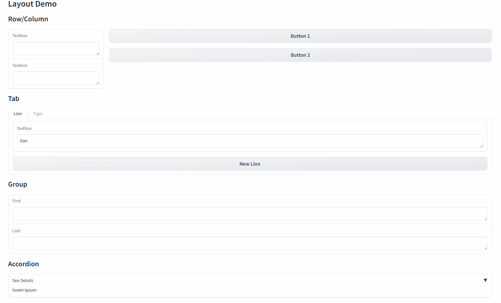
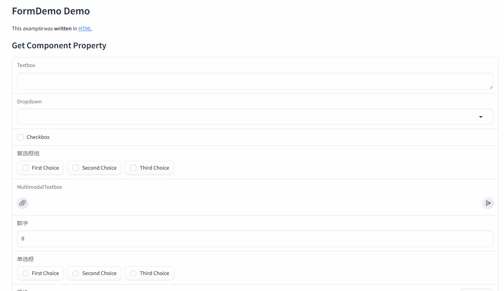
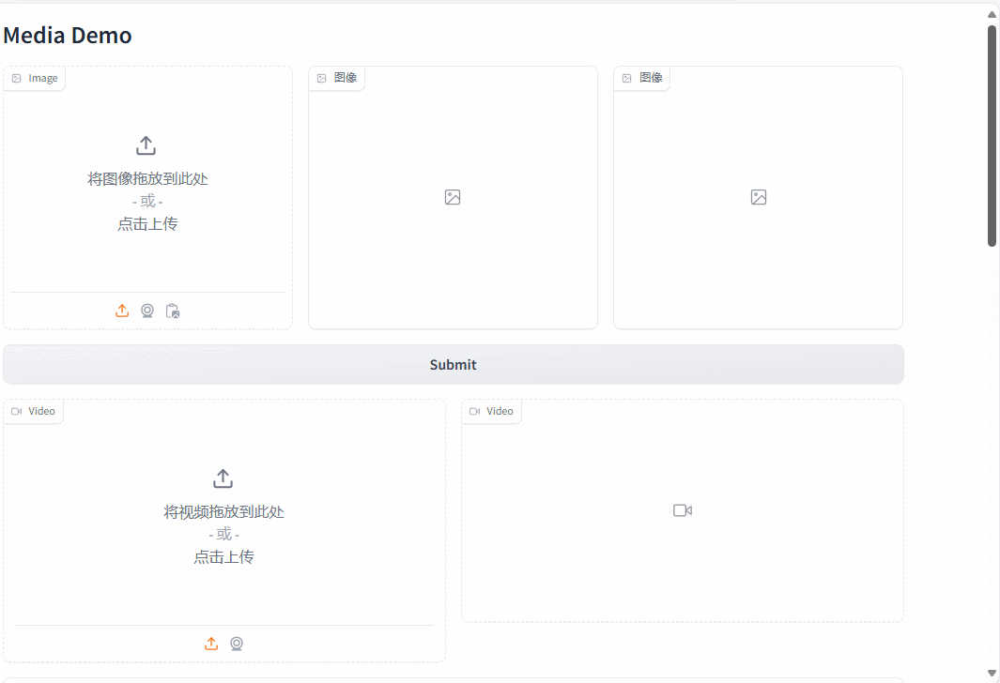
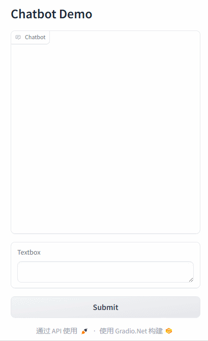
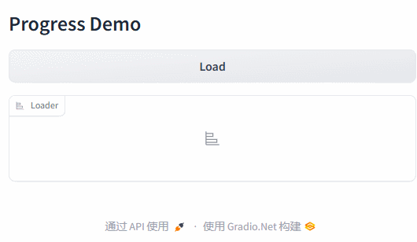

# Gradio.NET: Build Machine Learning Web Apps — in .NET [](https://github.com/feiyun0112/Gradio.Net/actions/workflows/main.yml) [](https://nuget.org/packages/Gradio.Net)

**English** | **[简体中文](readme_files/README_zh-cn.md)**

Gradio for .NET – a port of [Gradio](https://github.com/gradio-app/gradio), an open-source Python package that allows you to quickly **build** a demo or web application for your machine learning model, API, or any arbitrary Python function. *No JavaScript, CSS, or web hosting experience needed!*



It just takes a few lines of .NET code to create a beautiful demo like the one above, so let's get started 💫

### Building Your First Demo

- 1. Create a ASP.NET Core Web API project.

- 2. Install NuGet package **Gradio.Net**.

- 3. Enter the sample code in Program.cs:


```C#
App.Launch(await CreateBlocks());

async Task<Blocks> CreateBlocks()
{
    using (var blocks = gr.Blocks())
    {
        gr.Markdown("Start typing below and then click **Run** to see the output.");
        Textbox input, output;
        using (gr.Row())
        {
            input = gr.Textbox(placeholder: "What is your name?");
            output = gr.Textbox();
        }
        var btn = gr.Button("Run");
        await btn.Click(fn: async (input) => gr.Output($"Welcome to Gradio.Net, {Textbox.Payload(input.Data[0])}!"), inputs: new[] { input }, outputs: new[] { output });

        return blocks;
    }
}
```

That's All🎉🎉🎉

**If you wan to use **Gradio.Net** in exists project**

You can use `AddGradio` and `UseGradio` extension methods:

```C#
var builder = WebApplication.CreateBuilder(args);
builder.Services.AddGradio();

var app = builder.Build();

app.UseGradio(await CreateBlocks());

app.Run();
```

### Demos

| Source Code | Demo Image |
| ----------- | ---------- |
| [Layout](./readme_files/layout_demo.md) |  |
| [Form](./readme_files/form_demo.md) |  |
| [Media](./readme_files/media_demo.md) |  |
| [Chatbot](./readme_files/chatbot_demo.md) |  |
| [Progress](./readme_files/progress_demo.md) |  |
