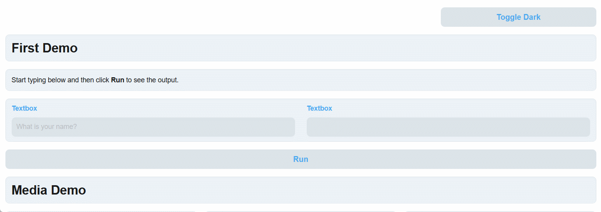

# Gradio.NET: .NETで機械学習Webアプリを構築 [](https://github.com/feiyun0112/Gradio.Net/actions/workflows/main.yml) [](https://nuget.org/packages/Gradio.Net)

**[English](../README.md)** | **[简体中文](readme_files/README_zh-cn.md)** | **日本語**

Gradio for .NET – [Gradio](https://github.com/gradio-app/gradio) の .NET 移植版で、機械学習モデル、API、または任意のPython関数のデモやWebアプリケーションを迅速に**構築**するためのオープンソースのPythonパッケージです。*JavaScript、CSS、またはWebホスティングの経験は不要です！*


上記のような美しいデモを作成するには、ほんの数行の .NET コードが必要です。それでは始めましょう 💫

### 最初のデモを構築する

- 1. ASP.NET Core Web API プロジェクトを作成します。

- 2. NuGet パッケージ **Gradio.Net.AspNetCore** をインストールします。

- 3. Program.cs にサンプルコードを入力します:


```C#
App.Launch(await CreateBlocks());

async Task<Blocks> CreateBlocks()
{
    using (var blocks = gr.Blocks())
    {
        gr.Markdown("Start typing below and then click **Run** to see the output.");
        Textbox input, output;
        using (gr.Row())
        {
            input = gr.Textbox(placeholder: "What is your name?");
            output = gr.Textbox();
        }
        var btn = gr.Button("Run");
        await btn.Click(fn: async (input) => gr.Output($"Welcome to Gradio.Net, {Textbox.Payload(input.Data[0])}!"), inputs: new[] { input }, outputs: new[] { output });

        return blocks;
    }
}
```

これで完了です🎉🎉🎉

**既存のプロジェクトで **Gradio.Net.AspNetCore** を使用したい場合**

`AddGradio` と `UseGradio` 拡張メソッドを使用できます：

```C#
var builder = WebApplication.CreateBuilder(args);
builder.Services.AddGradio();

var app = builder.Build();

app.UseGradio(await CreateBlocks());

app.Run();
```

### デモ

| Source Code | Demo Image |
| ----------- | ---------- |
| [Layout](./layout_demo.md) |  |
| [Form](./form_demo.md) |  |
| [Media](./media_demo.md) |  |
| [Chatbot](./chatbot_demo.md) |  |
| [Progress](./progress_demo.md) |  |
| [Theme](./theme_demo.md) |  |
