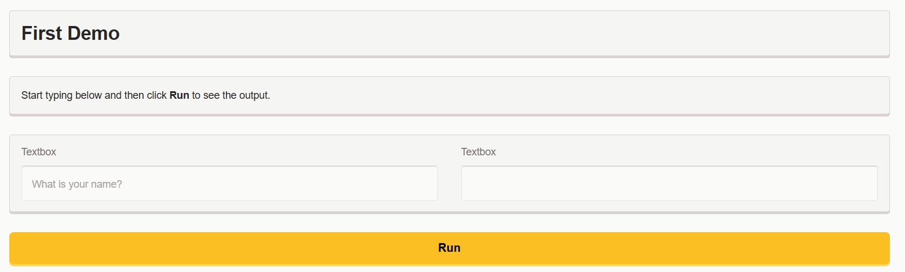
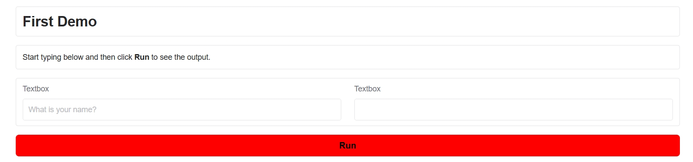
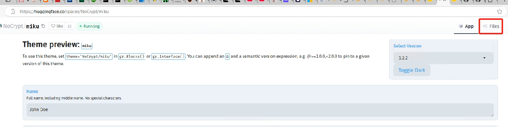
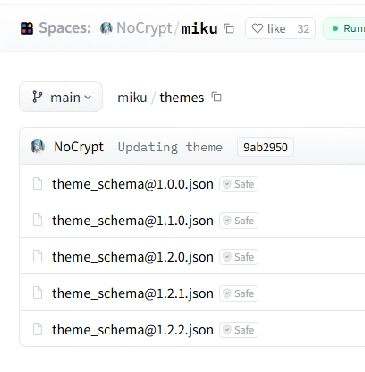
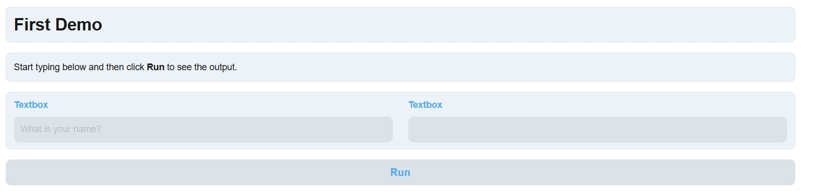

# Theming

## Introduction

Gradio.NET features a built-in theming engine that lets you customize the look and feel of your app. You can choose from a variety of themes, or create your own. 

To do so, set `config.Theme` in `App.Launch` method. For example:

```
App.Launch(await CreateBlocks(), config =>
{
    config.Theme = Themes.Citrus;
    ...
});
```



Gradio.NET comes with a set of prebuilt themes which you can load from `Themes.*`: 

- **Themes.Default** - the "default" Gradio 5 theme, with a vibrant orange primary color and gray secondary color.
- **Themes.Origin** - the "origin" theme is most similar to Gradio 4 styling. Colors, especially in light mode, are more subdued than the Gradio 5 default theme.
- **Themes.Citrus** - the "citrus" theme uses a yellow primary color, highlights form elements that are in focus, and includes fun 3D effects when buttons are clicked.
- **Themes.Monochrome** - the "monochrome" theme uses a black primary and white secondary color, and uses serif-style fonts, giving the appearance of a black-and-white newspaper.
- **Themes.Soft** - the "soft" theme uses a purpose primary color and white secondary color. It also increases the border radii and around buttons and form elements and highlights labels.
- **Themes.Glass** - the "glass" theme has a blue primary color and a transclucent gray secondary color. The theme also uses vertical gradients to create a glassy effect.
- **Themes.Ocean** - the "ocean" theme has a blue-green primary color and gray secondary color. The theme also uses horizontal gradients, especially for buttons and some form elements.

Each of these themes set values for hundreds of CSS variables. You can use prebuilt themes as a starting point for your own custom themes, or you can create your own themes from scratch. Let's take a look at each approach.


## Extending Themes via .Set()

You can also modify the values of CSS variables base on prebuilt theme. To do so, use the `.Set()` method of the theme object to get access to the CSS variables. For example:

```
App.Launch(await CreateBlocks(), config =>
{
    config.Theme = Themes.Default.Set(overrideStyles: new Dictionary<string, string> { { nameof(Theme.ButtonSecondaryBackgroundFill), "#FF0000" } });
    ...
});
```

In the example above, we've set the ButtonSecondaryBackgroundFill variables to #FF0000.



## Load Theme from file

The [Theme Gallery](https://huggingface.co/spaces/gradio/theme-gallery) shows all the public gradio themes. 

You can download theme file and pass it to your app. For example:

To use theme [NoCrypt/miku](https://huggingface.co/spaces/NoCrypt/miku), you can click Files link and donwload json file.



then use the `Theme.Load()` method

```
App.Launch(await CreateBlocks(), config =>
{
    config.Theme = Theme.Load("miku_theme.json");
    ...
});
```

